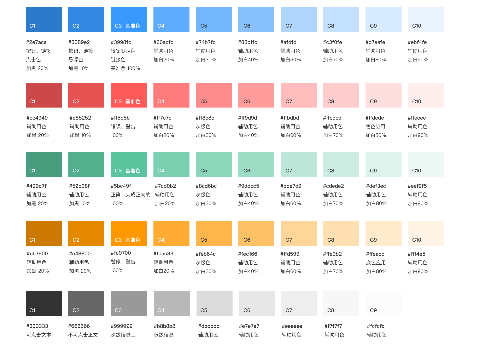
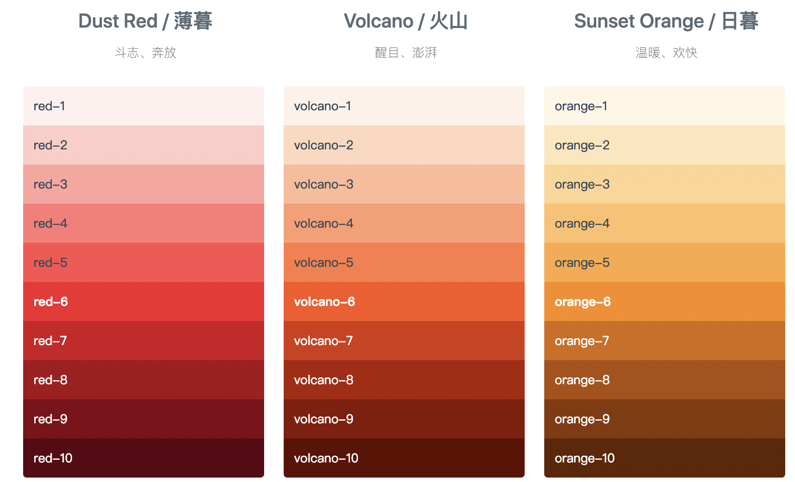
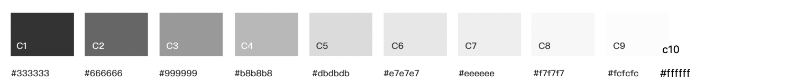

将[One Design - 色板](http://one-design.baidu-int.com/design/basic/color)进行细分，划分出基础色板、中性色板、文字颜色、状态颜色、数据图表配色。

# 基础色板（优化）

描述出每种基础色系的含义及应用场景。

**参考**

[Ant Design - 基础色板](https://ant.design/docs/spec/colors-cn#%E5%9F%BA%E7%A1%80%E8%89%B2%E6%9D%BF)

# 中性色板（新增）

中性色包含了黑、白、灰。合理的选择中性色能够令页面信息具备良好的主次关系，助力阅读体验。中性色板一共包含了从黑到白的 10 个颜色。

**参考**

[Ant Design - 中性色板](https://ant.design/docs/spec/colors-cn#%E4%B8%AD%E6%80%A7%E8%89%B2%E6%9D%BF)

# 文字颜色（新增）

从三个方面考量：

- 易读性标准：所有文本都应清晰易读并符合可访问性标准。Web内容可访问性指南（WCAG 2.0）AA级要求正常文本的文本和背景之间的颜色对比度为4.5.1，大文本为3：1

- 文字背景：文字在不同背景下的颜色选取（如浅色背景、彩色背景等）

- 文字作用：文字在不同作用场景下的颜色选取（如帮助文字、强调文字、已选文字、图标符号等）

**参考**

[Material Design - Text legibility](https://material.io/design/color/text-legibility.html)

# 状态颜色（新增）

- 元素在不同状态下的颜色选取（如启用、禁用、激活、高亮等）

- 能给用户的操作反馈明确信息的一组功能色（如成功、出错、失败等）

**参考**

[Material Design - State](https://material.io/design/color/color-usage.html#state)

[Ant Design - 功能色](https://ant.design/docs/spec/colors-cn#%E5%8A%9F%E8%83%BD%E8%89%B2)

# 数据图表配色（优化）

根据优化升级之后的 One Design 整体颜色规范，对原有的[数据图表](http://one-design.baidu-int.com/design/complex/charts)中的图表配色建议进行优化