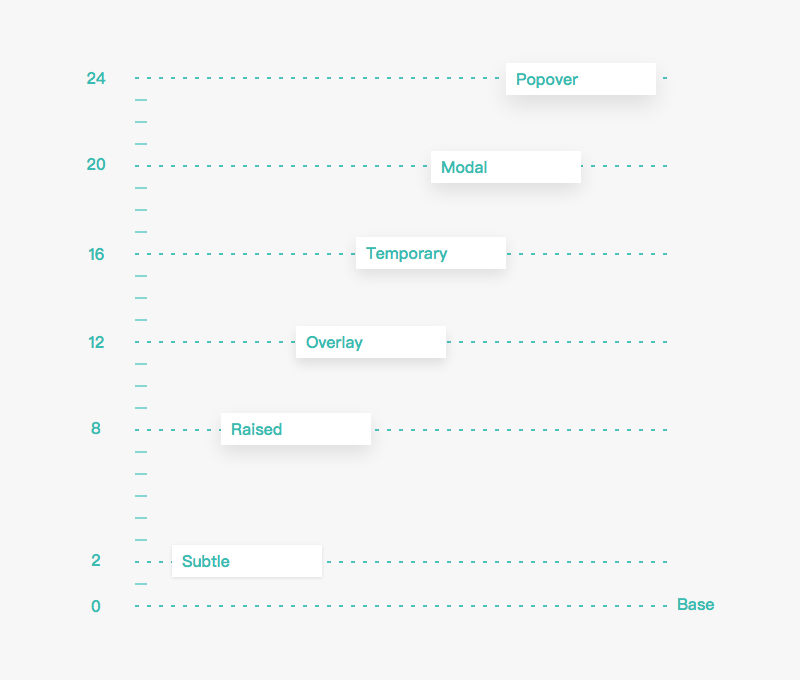

**原规范没有涉及，属于新增章节**

> 本文参考 [Clarity Design - 图层](https://design.teambition.com/visual-layer)

# 概述

图层本身承载了内容和组件，它是一种用来为内容建立组织关系和联系的视觉元素。我们通过区分图层位于 Z 轴的深度来赋予它们层级关系。

# 类型

类型 | 高度 | 投影 | 案例
------ | ------ | ------ | ------
Base | 0 | none | -
Subtle | 2 | 0 1px 2px 0 | 任务卡片
Raised | 8 | 0 4px 8px 0 | -
Overlay | 12 | 0 6px 12px 0 | -
Temporary | 16 | 0 6px 16px 0 | 信息盒
Modal | 20 | 0 8px 20px 0 | 模态弹窗
Popover | 24 | 0 10px 24px 0 | 菜单、下拉选项

# 物理属性

- 所有深度层级的图层厚度是一致的

- 使用 box-shadow 属性里 y 轴的 offset 值和 blur 值来区分不同深度层级，色值均为 #000000 的 10% 透明度

- 处于同一深度层级的图层不能同时占据相同的空间位置

- 不同深度层级之间可以堆叠（如一个 overlay layer 可以放置在 raised layer 之上）

- 只针对深度和 box-shadow 做了明确定义，容器本身可以被应用更多样式

# 图层内容

- 内容是被承载在图层之内的，不会影响深度层级

- 图层上的内容是被限制在图层这个容器内的，不能超越容器边界

# 深度层级

不同的图层类型被放置在不同的深度上，以 base layer 所处的深度为基础深度来进行衡量。深度的高低是由 box-shadow 的强烈程度来呈现的。

深度层级的范围由 0 到 24：

- 层级越高阴影越强烈

- 深度层级和它的阴影属性中的 blur 值一致

- 不是每个深度层级都对应一种图层类型