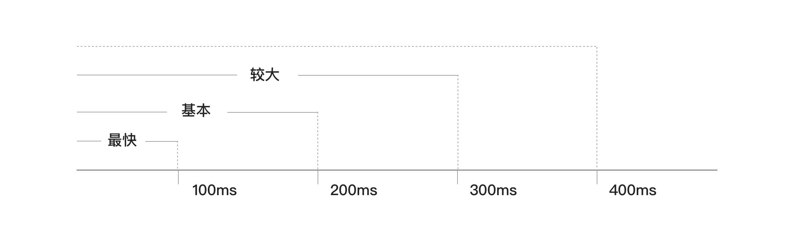
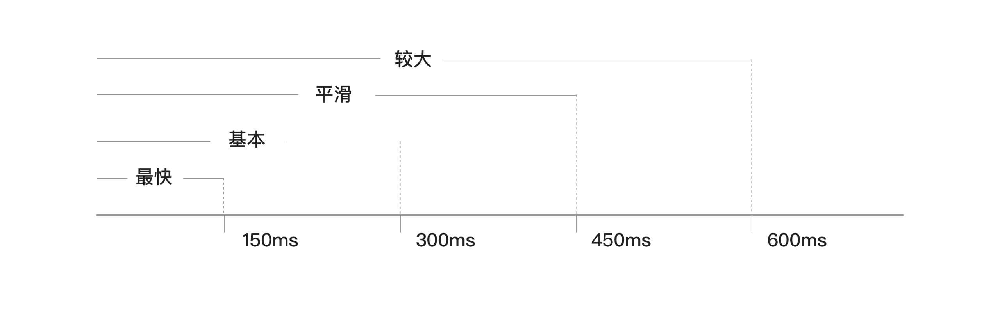
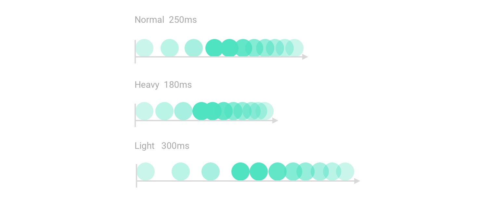
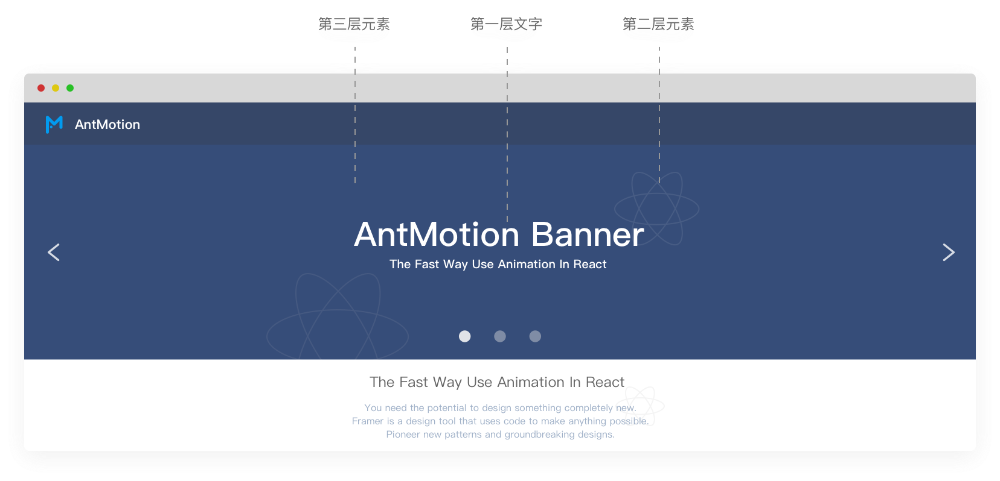

**原规范没有涉及，属于新增章节**

# 概述

- 动效能加强用户认知且增加活力

- 动效使得与用户的沟通更加清晰，帮助用户直达操作任务

- 动效使UI富有表现力且易于使用

> 参考 [Material Design- understanding motion](https://material.io/design/motion/understanding-motion.html)、[Clarity Design - 动效](https://design.teambition.com/visual-motion)、[Ant Design - 动效](https://ant.design/docs/spec/motion-cn)

# 原则

- 自然：自然运动规律，保证视觉连惯，让用户感知到动作是成立的。遵循客观物理世界的规律。如：加速运动、减速运动。适当地将物理运动规律运用在动效中，更加符合用户的认知逻辑，减少不必要的认知成本

- 高效：尽量节省过渡的时间，快速完成过渡的动画效果。若动画时间过长，会让用户产生拖沓、低效的印象，阻碍用户的操作

- 克制：做有意义的动效，不去做太多的修饰和干扰用户。在用户界面中使用轻盈的动画，减少动效的突兀感，有助于营造更轻松、清爽的氛围

- 力度差异：为不同的交互组件提供不同的运动力度，力度越大的运动代表操作越重要，可以无形之中在大脑中建立与现实物理运动的关联，加强用户的感知

- 信息化：显示元素之间的空间和层次关系，哪些操作可用，以及如果采取操作将会发生什么

> 参考 [Material Design- Principles](https://material.io/design/motion/understanding-motion.html#)、[Clarity Design - 原则](https://design.teambition.com/visual-motion)、[Ant Motion - 原则](https://motion.ant.design/language/principle-cn)

# 速度

在企业级应用的设计中，动效需要在尽可能短的时间内有效的完成过渡。那么如何把握这个时间的长短呢？伦敦城市学院神经学创立者 [Davina Bristow](http://www.ucl.ac.uk/media/library/blinking) 曾提出， 眨眼是人体最快的潜意识动作，大多数人每分钟眨眼 15 次，眨眼平均持续 100-150 毫秒；所以我们将这个时间段定义成 One Design 动效的基本时间单位。

- 统一的组件动效时间。最快时间: 100ms, 基本时间: 200ms, 较大时间：300ms... 100 的倍增方式

- 统一的页面转换动效时间。最快时间: 150ms, 基本时间: 300ms, 平滑时间：450ms, 较大时间: 600ms... 150 的倍增方式

- 组件或者页面的动效速度：匀速运动、加速运动和减速运动

> 参考 [Material Design- speed](https://material.io/design/motion/speed.html#)、[Clarity Design - 时间](https://design.teambition.com/visual-motion)、[Ant Motion - 速度](https://motion.ant.design/language/speed-cn)

# 力度

可分为三种运动力度，分别是正常，重，轻。在使用尤其是提示类组件时，不同的力度动画表现出了不同的紧急程度，三种运动力度分别表现普通提示、非常重要提示、次要提示。全屏弹出提示同样也具备不同的力度。

力度的应用，可以使用户在不经意间，感受到与物理世界相同的重力感应，通过更改速率、运动趋势、时效等手段，呈现三种不同的力度，将有效地加大交互体验与用户情绪、心理的关联。从而提供真实，可靠的用户体验。

> 参考 [Clarity Design - 力度](https://design.teambition.com/visual-motion)

# 空间

现实空间里，物体存在远小近大的原则，运动则有远慢近快。在动效设计时，处理和空间相关的话题时，我们需要考虑两方面的因素：

- 视差：例如汽车在公路上行驶，离汽车越近的物体，移动速度越接近汽车的速率。以行进中的汽车为例，汽车所在的点为 X 轴的基准点，离基准点越远时，速度就越慢。动效设计中同样存在这个原则，元素的空间距离会影响动画效果，从而影响动效设计的决策

- 大小：遵循远处的物体小，近处的物体大的原则

> 参考 [Ant Motion - 空间](https://motion.ant.design/language/speed-cn)

# 组合

组合动效是将多种动画效果组合起来运用在单个元素或者界面中的表现方式，吸引用户的注意，让用户快速了解信息的主次关系。

- 单元素组合动画

- 多元素列队动画

- 多元素聚散动画

> 参考 [Material Design- choreography](https://material.io/design/motion/choreography.html)、[Ant Motion - 组合](https://motion.ant.design/language/combined-cn)

# 过渡

过渡是更复杂的组合动画效果，组合动画是针对当前的元素进行的一个进出场效果，而过渡往往需要多个不同的动画来完成一段多个页面中间的过渡。

## 视觉连贯性三元素

- Adding: 新加入的信息元素应被告知如何使用，从页面转变的信息元素需被重新识别

- Receding: 与当前页无关的信息元素应采用适当方式移除

- Normal: 指那些从转场开始到结束都没有发生变化的信息元素

> 参考 [Ant Motion - 视觉连贯性三元素](https://motion.ant.design/language/transition-cn#%E8%A7%86%E8%A7%89%E8%BF%9E%E8%B4%AF%E6%80%A7%E4%B8%89%E5%85%83%E7%B4%A0)

## 视图变化时保持上下文

- 页面间切换

- 传送带切换(走马灯)

- 折叠窗口

> 参考 [Ant Motion - 视图变化时保持上下文](https://motion.ant.design/language/transition-cn#%E8%A7%86%E5%9B%BE%E5%8F%98%E5%8C%96%E6%97%B6%E4%BF%9D%E6%8C%81%E4%B8%8A%E4%B8%8B%E6%96%87)

## 解释刚刚发生了什么

将用户操作可视化, 来增强用户对操作行为的感知度, 同时也能对元素内容的认知;

在列表或表格中, 变更一个对象时, 加入对象出现与消失效果, 以提示用户所操作的行为。

- 对象增加：增加后, 用一个动画和背景色来区分新增元素, 过一段时间再恢复正常

- 对象删除：删除后, 用移出的效果来做删除的效果

- 对象更改：用户更改了内容时, 在保存后, 在修改过的位置出现背景色, 表示该对象发生过变更, 然后背景色持续一断时间再消失, 恢复正常

- 弹出框呼出：从页面的某个按钮呼出弹出框时, 弹框从按钮处呼起, 可提示用户弹框与按钮的关系

> 参考 [Ant Motion - 解释刚刚发生了什么](https://motion.ant.design/language/transition-cn#%E8%A7%A3%E9%87%8A%E5%88%9A%E5%88%9A%E5%8F%91%E7%94%9F%E4%BA%86%E4%BB%80%E4%B9%88)

## 改善感知性能

当无法有效提升『实际性能』时，可以考虑适当转移用户的注意力，来缩短某项操作的感知时间，改善感知性能。

> 参考 [Ant Motion - 改善感知性能](https://motion.ant.design/language/transition-cn#%E6%94%B9%E5%96%84%E6%84%9F%E7%9F%A5%E6%80%A7%E8%83%BD)