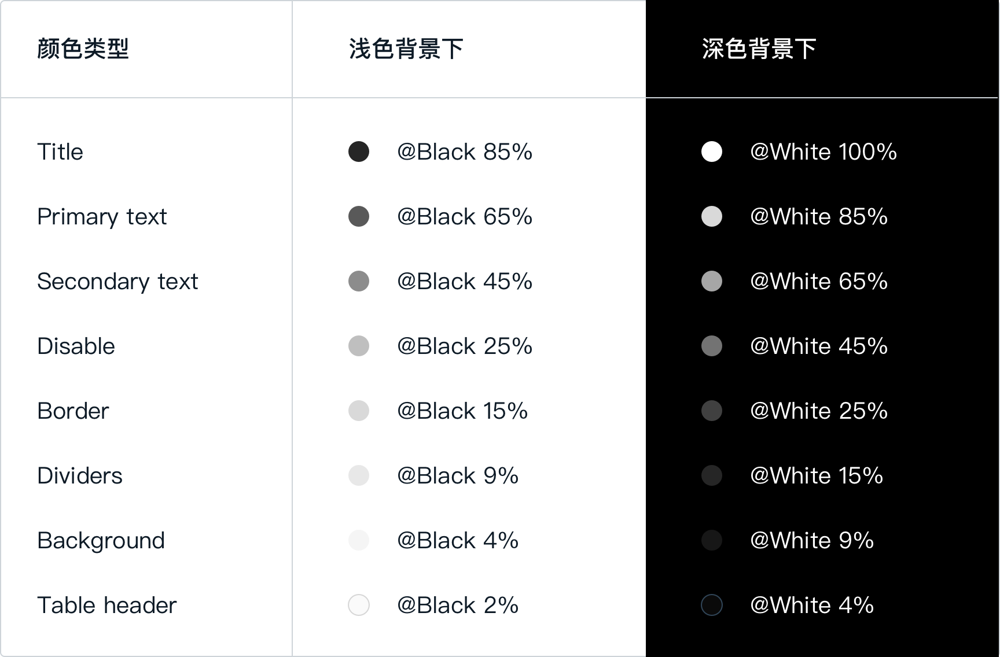

原规范：http://one-design.baidu-int.com/design/basic/typography

# 主字体（新增）

我们基于电脑显示器阅读距离（50 cm）以及最佳阅读角度（0.3）对 Ant Design 的主字体进行了一次升级，从原先的 12 上升至 14，以保证在多数常用显示器上的用户阅读效率最佳。

> 参考 [Ant Design - 主字体](https://ant.design/docs/spec/font-cn#%E4%B8%BB%E5%AD%97%E4%BD%93)

# 字体颜色（新增）

文本颜色如果和背景颜色太接近就会难以阅读。考虑到无障碍设计的需求，我们参考了 WCAG 的标准，将正文文本、标题和背景色之间保持在了 7:1 以上的 AAA 级对比度。

> 参考 [Ant Design - 字体颜色](https://ant.design/docs/spec/font-cn#%E5%AD%97%E4%BD%93%E9%A2%9C%E8%89%B2)